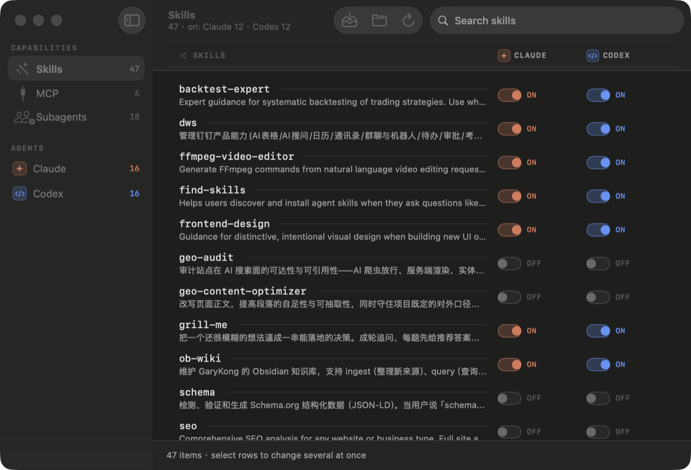
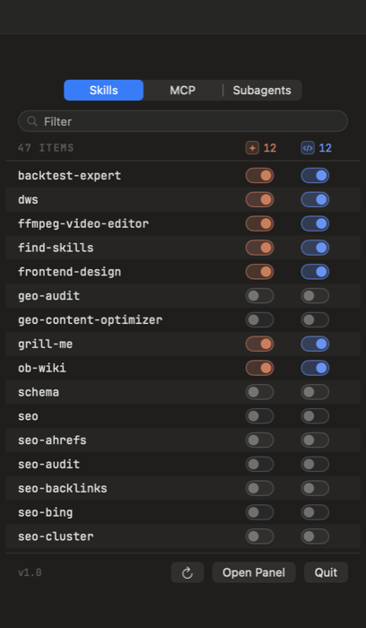

<div align="center">


# Ambit

**Which skills, MCP servers and subagents can Claude Code see? Which can Codex see?**
One matrix, one switch each, and nothing gets deleted.

</div>



<div align="center"></div>

Claude Code and Codex both load skills, MCP servers and subagents — from different directories, in
different formats, with different rules about what counts as "installed". There is no single place to
see what each one is actually loading, and no way to give something to one agent but not the other.

This is that place. It lives in the menu bar, it reads the truth off your filesystem every time, and
turning something off means the agent stops finding it — never that a file got removed.

```
Skills                     Claude     Codex
  seo                        ON        ON
  shopify                    ON        OFF
  audio-research             OFF       ON
  legacy-notes               EXTERNAL  OFF
```

## Install

Requires macOS 26.

```bash
brew install --cask JC-kk/tap/ambit
```

Or download `Ambit-1.0.0.dmg` from [Releases](../../releases) and drag Ambit to Applications.

Then, either way:

```bash
xattr -dr com.apple.quarantine /Applications/Ambit.app
```

### Why that extra command

Ambit is ad-hoc signed, not notarised. Notarisation needs a paid Apple Developer Program membership
and this is a free tool, so macOS marks the download as quarantined and may refuse to open it.

That one line clears the flag. It applies after a `brew install` too — the flag comes from
downloading the disk image, not from Homebrew, and brew copies the app out of the mounted volume
without stripping it. (Measured: nine quarantine attributes on `/Applications/Ambit.app` after a
clean cask install.)

If macOS blocks it anyway, go to **System Settings → Privacy & Security** and press **Open Anyway**.
On macOS 15 and later the old Control-click → Open shortcut no longer works for unnotarised apps, so
System Settings is the only route.

`spctl --assess` will always report `rejected` for Ambit, before *and* after clearing quarantine.
That is expected — it asks whether the app satisfies the notarisation policy, which an ad-hoc
signature never can, and it is not the same question as whether the app will launch.

Every release publishes `checksums.txt` so you can verify what you downloaded:

```bash
shasum -a 256 -c checksums.txt
```

Ambit makes no network requests at all — if you would rather not trust a binary, the whole thing is
~2,700 lines of logic and ~1,400 of UI, and it builds in about ten seconds.

### Build it yourself

Xcode 26+, no other dependencies — no Rust, no Node, no package manager:

```bash
./build.sh && open Ambit.app
```

A locally built copy is never quarantined, so nothing extra is needed.

## Start here: Consolidate

Out of the box your skills and subagents live inside Claude's and Codex's own folders, which is why
the two columns move together. **Consolidate** moves each source into `~/.agent-capabilities` and
links it straight back, so nothing changes about what either agent can see — the switches just start
working.

It shows you the whole plan first. Nothing is deleted: a duplicate that cannot become the canonical
copy is parked under `backups/`, and every move is written to a manifest.

```bash
Ambit --consolidate          # print the plan
Ambit --consolidate --yes    # carry it out
```

## Two ways to read the same thing

The sidebar switches between the two axes:

- **Skills / MCP / Subagents** — the capability × agent matrix. *Who can see this thing?*
- **Claude / Codex** — that agent's whole inventory across all three kinds, with just its own switch
  and a dimmed note of what the other agent is doing. *What is this agent loading right now?*

## Reading the interface

Two rules carry the whole thing.

**Saturated colour means agency.** Clay is Claude, blue is Codex, and a switch is coloured only when
that agent is really loading the thing. Amber and red are the only other colours and they mean
attention, not agency. So the amount of clay on screen answers "how much is Claude loading" before
you read a word.

**Monospace means machine, sans means human.** Capability names *are* identifiers —
`ffmpeg-video-editor`, `seo-technical` — so they are set in mono along with every count and status.
Descriptions and explanations are prose and stay in the system face.

The switch itself encodes whether you can do anything about it:

| | track | knob |
|---|---|---|
| `ON` | solid | right, agent colour |
| `OFF` | solid | left |
| `EXTERNAL` | **dashed** — this app does not govern it | right, amber |
| `BROKEN` | dashed | centre, red |
| `N/A` | dashed | none |

A dashed track always means clicking will not help, and the tooltip says why.

## The five states

| | meaning |
|---|---|
| `ON` | that agent can discover it right now |
| `OFF` | it cannot |
| `EXTERNAL` | discoverable, but the on-disk entry was not created by this app |
| `BROKEN` | present but unusable — dangling link, missing `SKILL.md`, unparseable config |
| `N/A` | that agent has no discovery mechanism for this kind |

Nothing is cached. Every status is re-derived from `lstat`, `realpath` and the agents' own config
files on each scan, so the app cannot drift out of sync with reality. When a switch is disabled, the
tooltip says exactly why.

## How exposure actually works

| kind | Claude Code | Codex |
|---|---|---|
| Skill | symlink in `~/.claude/skills` | symlink in `~/.codex/skills` |
| Subagent | **hard link** in `~/.claude/agents` | `[agents.<name>]` in `config.toml` |
| MCP | parked in / restored to `~/.claude.json` | native `enabled` key in `config.toml` |

Every one of those was pinned down against a specific CLI version rather than assumed. Three that
are easy to get wrong:

- **Codex scans `~/.agents/skills` as well as `~/.codex/skills`.** Anything there is on for Codex
  unconditionally, which is why the library lives somewhere neither agent scans.
- **Claude Code's subagent scanner skips symlinked `.md` files** (`if (entry.isSymbolicLink())
  continue`). Hard links are regular files to every reader, share the library file's inode, and
  unlinking one cannot destroy the library copy.
- **Codex subagents are real**, declared as `[agents.<name>]` pointing at a role file with `name`,
  `description` and `developer_instructions`. Claude's `.md` format is not compatible, so switching
  Codex on converts it. `codex doctor` validates the result.

`DESIGN.md` has the full findings and the probe used for each.

## Safety

This app edits files you cannot afford to lose, so the rules are narrow and enforced in the core
rather than the UI:

- **Disabling never deletes a source.**
- Removal requires proof of ownership: a symlink must resolve inside the library; a hard link must
  share the library file's inode *and* not be the last link to its data.
- A regular file or directory in a discovery path is never deleted, and neither is a symlink this app
  did not create. Where that leaves no safe way to switch something off, the switch is disabled and
  says so instead of guessing.
- JSON configs are edited as **text** — one top-level key spliced in place. Key order, indentation
  and float formatting survive byte for byte. (Re-serialising `~/.claude.json` would silently rewrite
  thousands of unrelated bytes; Foundation does not round-trip doubles.)
- TOML edits touch a single key or table and leave comments, ordering and unknown keys alone.
- Every config write is **backup → parse → minimal edit → validate → atomic rename**. If the result
  would disturb anything outside the intended change, nothing is written.
- If a library source is deleted by something else, the app tells you rather than quietly dropping it
  from the list.

52 tests cover these, all against throwaway fixture trees — the suite never touches a real
`~/.claude` or `~/.codex`.

## Command line

```bash
Ambit --print                 # the matrix, as text; read-only
Ambit --consolidate [--yes]   # plan, or carry it out
Ambit --panel                 # open the desktop panel directly
AMBIT_HOME=/tmp/fake Ambit      # point everything at a throwaway tree
```

## If your Codex column looks stuck

`~/.claude/skills` is often a symlink to `~/.agents/skills`, which Codex also scans — so every skill
exposed to Claude is on for Codex too, and the app correctly shows that column as `EXTERNAL` and
disabled. **Consolidate** fixes it by turning `~/.claude/skills` back into a real directory. It will
not happen on its own.

Afterwards, if you have a standing instruction telling agents to install skills into
`~/.agents/skills` (`~/.codex/AGENTS.md`, `CLAUDE.md`), point it at the library instead or new skills
will land outside it.

## What this deliberately is not

No marketplace, no chat, no API keys, no usage dashboards, no cloud sync, no accounts, no background
daemon. It is a local control panel for inventory and exposure. Anything that is not that belongs in
a different app.

## Contributing

See [CONTRIBUTING.md](CONTRIBUTING.md). The short version: mechanisms need evidence, not guesses —
if you change how a capability is discovered, include the probe that proves it.

MIT licensed.
